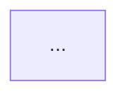

## User Input

```text
$ARGUMENTS
```

You **MUST** consider the user input before proceeding (if not empty).

## Pre-Execution Checks

**Check for extension hooks (before design)**:
- Check if `.audi/extensions.yml` exists in the project root.
- If it exists, read it and look for entries under the `hooks.before_design` key.
- If the YAML cannot be parsed or is invalid, skip hook checking silently and continue normally.
- Filter out hooks where `enabled` is explicitly `false`. Treat hooks without an `enabled` field as enabled by default.
- For each remaining hook, do **not** attempt to interpret or evaluate hook `condition` expressions:
  - If the hook has no `condition` field, or it is null/empty, treat the hook as executable.
  - If the hook defines a non-empty `condition`, skip the hook and leave condition evaluation to the HookExecutor implementation.
- For each executable hook, output the following based on its `optional` flag:
  - **Optional hook** (`optional: true`):
    ```
    ## Extension Hooks

    **Optional Pre-Hook**: {extension}
    Command: `/{command}`
    Description: {description}

    Prompt: {prompt}
    To execute: `/{command}`
    ```
  - **Mandatory hook** (`optional: false`):
    ```
    ## Extension Hooks

    **Automatic Pre-Hook**: {extension}
    Executing: `/{command}`
    EXECUTE_COMMAND: {command}

    Wait for the result of the hook command before proceeding to the Outline.
    ```
- If no hooks are registered or `.audi/extensions.yml` does not exist, skip silently.

## Outline

### Goal

Produce `design.md` — a detailed architecture and design document that bridges the implementation plan (`plan.md`) and actual code. This document is the authoritative technical reference developers use during implementation.

### Inputs

1. Run `.audi/scripts/powershell/setup-plan.ps1 -Json` from repo root and parse JSON for `FEATURE_SPEC`, `IMPL_PLAN`, `SPECS_DIR`, `BRANCH`.
2. Load `spec.md` — requirements, user stories, acceptance criteria, entities.
3. Load `plan.md` — architecture decisions, module breakdown, technology choices.
4. Load `.audi/memory/constitution.md` (if present) — binding architectural principles.

### Design Document Structure

Write `{SPECS_DIR}/design.md` with the following sections. Populate every section concretely — no placeholder text.

---

#### 1. Overview

- **Feature**: (from spec.md)
- **Branch**: `{BRANCH}`
- **Design Status**: Draft
- **Input Artifacts**: `spec.md`, `plan.md`

A 2–4 sentence summary of what is being built and the key architectural decisions made.

---

#### 2. Architecture Diagram

Produce a Mermaid component/layer diagram showing:
- All major components/modules and their responsibilities
- Data flow between components (arrows with labels)
- External systems or services (clearly marked as external)
- Boundaries (e.g., API boundary, persistence boundary)



Every node must have a short label and a brief description in a table beneath the diagram:

| Component | Responsibility |
|-----------|---------------|
| ...       | ...           |

---

#### 3. Data Model

For every entity identified in `spec.md`:

| Field | Type | Nullable | Constraints | Notes |
|-------|------|----------|-------------|-------|
| ...   | ...  | ...      | ...         | ...   |

Include:
- Primary and foreign keys
- Uniqueness constraints
- Lifecycle/state fields (e.g., `created_at`, `status`)
- Indexes worth noting for query performance

If relationships exist between entities, add an ER diagram:

```mermaid
erDiagram
    ...
```

---

#### 4. API Contract

For every endpoint or interface exposed by the feature:

**`METHOD /path`**

| Field | Value |
|-------|-------|
| Description | ... |
| Auth required | Yes / No |
| Request Content-Type | ... |

**Request body** (if applicable):
```json
{
  "field": "type — description"
}
```

**Response — Success (`2xx`)**:
```json
{
  "field": "type — description"
}
```

**Response — Error cases**:

| Status | Condition | Body |
|--------|-----------|------|
| 400 | ... | `{"error": "..."}` |
| 404 | ... | `{"error": "..."}` |

---

#### 5. Key Flows (Sequence Diagrams)

For each primary user story from `spec.md`, produce a Mermaid sequence diagram showing the full request-to-response flow including:
- Actor → API → Service Layer → Data Layer
- External service calls (if any)
- Error paths

```mermaid
sequenceDiagram
    actor User
    ...
```

---

#### 6. Technology Decisions

For each technology choice from `plan.md`, document the decision rationale:

| Decision | Choice | Rationale | Rejected Alternatives |
|----------|--------|-----------|----------------------|
| ...      | ...    | ...       | ...                  |

---

#### 7. Error Handling Strategy

- How errors propagate through layers (data → service → API)
- Error response format (schema)
- Logging strategy (what gets logged, at what level)
- Retry / fallback behavior (if applicable)

---

#### 8. Security Design

- Authentication / authorization approach
- Input validation points
- Sensitive data handling (PII, secrets)
- Known threat mitigations

---

#### 9. Non-Functional Design

| Concern | Target | Approach |
|---------|--------|---------|
| Performance | ... | ... |
| Scalability | ... | ... |
| Reliability | ... | ... |
| Observability | ... | ... |

---

#### 10. Open Questions / Risks

List any design decisions that are uncertain or carry implementation risk. For each:
- **Question/Risk**: what is uncertain
- **Impact**: what breaks if decided wrong
- **Proposed Resolution**: recommended path forward
- **Owner**: who should resolve this (Dev / PO / Architect)

---

### Validation

After writing `design.md`, verify:
- [ ] Every entity from `spec.md` is reflected in the data model
- [ ] Every user story from `spec.md` has a corresponding sequence diagram
- [ ] Every endpoint from `plan.md` has a full API contract entry
- [ ] No `[PLACEHOLDER]` or `[TODO]` markers remain
- [ ] All Mermaid diagrams are syntactically valid (no unclosed blocks)
- [ ] Technology decisions table covers all choices mentioned in `plan.md`

If any validation item fails, fix it before reporting completion.

### Completion Report

Report:
- Path to `design.md`
- Sections written (list)
- Count of: entities modeled, endpoints documented, sequence diagrams produced, open questions identified
- Any constitution constraints that influenced design decisions
- Suggested next command: `/audi.checklist` (design review) or `/audi.tasks`
