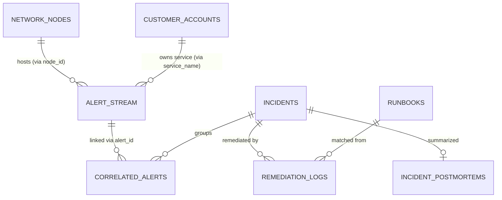

# Design: SRE Agentic AI Incident Prevention & Resolution Platform

## 1. Overview

- **Feature**: SRE Agentic AI Incident Prevention & Resolution Platform
- **Branch**: `001-json-agentic-ai`
- **Design Status**: Draft (regenerated for the existing-warehouse premise)
- **Input Artifacts**: [spec.md](./spec.md), [plan.md](./plan.md), [research.md](./research.md), [data-model.md](./data-model.md), [contracts/rest-api.md](./contracts/rest-api.md), [contracts/pubsub-events.md](./contracts/pubsub-events.md)

**Note**: This document **replaces in full** the prior version, which described a JSON-upload/Cloud-Storage-landing/ETL architecture no longer in scope. The BigQuery warehouse (`sre_telemetry`, `sre_topology`, `sre_knowledge_base`, `sre_incident_mart`) is already provisioned and populated; this platform is a pure consumer of it, plus a writer of exactly four tables (`correlated_alerts`, `incidents`, `remediation_logs`, `incident_postmortems`, per FR-039).

This platform replays the existing `alert_stream` history through Pub/Sub (simulating a live burst) and drives six ADK `LlmAgent`s — Alert Correlation, Root Cause Analysis, Runbook Retrieval, Predictive Risk, Remediation, and Executive Impact — through a custom event-driven orchestrator to turn a storm of replayed alerts into a single explained incident, a semantically-retrieved runbook (BigQuery `VECTOR_SEARCH` over the existing `runbooks.embedding`), a human-approved and really-executed fix, a BigQuery-ML-forecasted outage warning, an executive business-impact view, and an automatically written postmortem. Every output is derived from live, parameterized queries against the existing warehouse — never a hardcoded mapping (NFR-011). Firestore holds every live/ephemeral projection (approvals, predictions, executive metrics); Cloud Logging carries the audit trail; no new BigQuery table is invented beyond the four FR-039 writes and one platform-owned `sre_ml_ops` BQML dataset.

---

## 2. Architecture Diagram

```mermaid
flowchart TD
    subgraph WH["Existing BigQuery warehouse (read-only except 4 tables)"]
        AS[("sre_telemetry.alert_stream")]
        NN[("sre_topology.network_nodes")]
        RB[("sre_knowledge_base.runbooks + embedding_model")]
        CA[("sre_incident_mart.customer_accounts")]
        INC[("sre_incident_mart.incidents")]
        CAL[("sre_incident_mart.correlated_alerts")]
        RL[("sre_incident_mart.remediation_logs")]
        PM[("sre_incident_mart.incident_postmortems")]
    end

    ML[("sre_ml_ops.alert_trend_forecast_model<br/>ARIMA_PLUS (new, platform-owned)")]
    VERTEXAI["Vertex AI<br/>Gemini 2.5 Flash/Pro + text-embedding-005"]

    ARS["Cloud Run<br/>alert-replay-service"]
    PS[("Pub/Sub<br/>alerts.replay + agent hand-off topics")]
    ORC["Cloud Run (autoscaled)<br/>agent-orchestrator — 6 ADK LlmAgents"]
    SCHED["Cloud Scheduler<br/>predictions.tick / retrain cadence"]
    FS[("Firestore<br/>approvals/ predictions/ executive_metrics/ pending_alerts")]
    GW["Cloud Run<br/>api-gateway (Firebase Auth + RBAC)"]
    DTS["Cloud Run<br/>demo-target-service (isolated sandbox)"]
    FE["Next.js frontend<br/>8 UI pages"]

    subgraph CrossCutting["Cross-cutting"]
        SM["Secret Manager"]
        IAM["IAM / Service Accounts"]
        LOG["Cloud Logging + Cloud Audit Logs"]
    end

    ARS -->|"read-only"| AS
    ARS -->|"alerts.replay (fresh replayEventId)"| PS
    PS --> ORC
    ORC -->|"parameterized reads"| AS
    ORC --> NN
    ORC --> RB
    ORC --> CA
    ORC --> INC
    ORC --> RL
    ORC -->|"write only"| CAL
    ORC -->|"MERGE"| PM
    ORC -->|"AI.GENERATE_EMBEDDING + VECTOR_SEARCH"| RB
    ORC <-->|"ML.FORECAST / DETECT_ANOMALIES / EXPLAIN_FORECAST"| ML
    ORC -->|"Gemini inference"| VERTEXAI
    ORC <-->|"live state"| FS
    ORC -->|"audit entries"| LOG
    ORC -->|"real execution (approved only)"| DTS
    SCHED -->|"predictions.tick"| ORC
    SCHED -->|"retrain trigger"| ML

    GW <-->|"realtime + drill-down"| FS
    GW -->|"read-only drill-downs"| WH
    GW -->|"approval decisions only"| PS
    FE <-->|"REST (contracts/rest-api.md)"| GW
    FE <-->|"realtime listeners"| FS

    CrossCutting -.-> ARS
    CrossCutting -.-> ORC
    CrossCutting -.-> GW
    CrossCutting -.-> DTS
```



| Component | Type | Responsibility |
|---|---|---|
| `alert_stream`, `network_nodes`, `runbooks`/`embedding_model`, `customer_accounts`, `incidents`, `correlated_alerts`, `remediation_logs`, `incident_postmortems` | Existing BigQuery warehouse | Single source of truth; read-only except the 4 named write tables (FR-001, FR-039) |
| `sre_ml_ops.alert_trend_forecast_model` | New BQML `ARIMA_PLUS` model | Forecasts/anomaly detection over `alert_stream` trends (FR-022/023) |
| Vertex AI | Managed GCP service | Serves Gemini reasoning + `text-embedding-005` query-time embeddings |
| `alert-replay-service` | Custom Cloud Run service | Read-only replay of `alert_stream` at ≥1,000 msgs/min, envelope-wrapped with a fresh `replayEventId` (Clarification #2) |
| Pub/Sub | Managed GCP service | `alerts.replay` ingress + inter-agent hand-off topics, each with a DLQ |
| `agent-orchestrator` | Custom Cloud Run service | Hosts all 6 ADK `LlmAgent`s behind per-topic push subscriptions |
| Cloud Scheduler | Managed GCP service | Drives Agent 4's forecast cadence and the `ARIMA_PLUS` retrain cadence, independent of alert traffic |
| Firestore | Managed GCP service | Sole store for approvals, predictions, executive metrics, and the short-TTL clustering window — never the system of record |
| `api-gateway` | Custom Cloud Run service | BFF: Firebase auth + RBAC, REST contract, sole publisher of approval decisions, audit logging |
| `demo-target-service` | Custom Cloud Run service (sandbox) | Isolated, low-privilege real execution target for approved remediations |
| Next.js frontend | Custom app | Renders the 8 required UI pages; Firebase JS SDK for auth + realtime Firestore reads |
| Secret Manager / IAM / Cloud Logging | Managed GCP services | Cross-cutting security and audit (§7) |

---

## 3. Component Architecture

### 3.1 Cloud Run Services

- **alert-replay-service** — the only reader of `alert_stream` at the raw-row level; loops over the ~3,000 rows (ordered by `timestamp`) at a controlled rate to sustain ≥1,000 msgs/min, wrapping each occurrence in an `alerts.replay` envelope with a fresh `replayEventId` (UUID) and rewritten `occurredAt` (FR-004; never mutates the source table).
- **agent-orchestrator** — hosts all 6 ADK agents behind independent Pub/Sub push subscriptions; a custom orchestrator layer invokes `Runner.run_async(...)` per stage, writes BigQuery (if the stage owns one of the 4 FR-039 tables) then Firestore then publishes the next event, and autoscales independently per stage to absorb the alert burst (NFR-001/002).
- **api-gateway** — Backend-for-Frontend for all 8 UI pages; verifies Firebase ID tokens and enforces custom-claim RBAC (FR-035); the **only** code path that can publish `remediation.approved`/`remediation.rejected` (never the LLM's own judgement, NFR-009); writes a Cloud Logging audit entry for every security-relevant request (FR-037).
- **demo-target-service** — isolated, low-privilege Cloud Run service that is the literal target of real remediation execution (an authenticated, Google-signed-OIDC-token HTTP call to its own `/remediate`/`/rollback` endpoints — the real GCP-native mechanism for one Cloud Run service to securely invoke another, enforced by Cloud Run IAM ingress control, not a literal Cloud Run Admin API call); contains blast radius to a purpose-built service, never production infrastructure.

### 3.2 ADK Agents & Warehouse Query Patterns

| # | Agent | Model | Reads (join path) | Writes | Spec refs |
|---|---|---|---|---|---|
| 1 | Alert Correlation | `gemini-2.5-flash` | `network_nodes` via `node_id`; precedent via `correlated_alerts`→`alert_stream`→`incidents` | `correlated_alerts`, `incidents` (new) | FR-006–FR-011 |
| 2 | Root Cause Analysis | `gemini-2.5-pro` | `correlated_alerts`→`alert_stream`→`network_nodes`; historical `incidents`↔`remediation_logs` | `incidents` (update) | FR-009 |
| 3 | Runbook Retrieval | `gemini-2.5-flash` | `VECTOR_SEARCH` over `runbooks.embedding`, query text embedded via `AI.GENERATE_EMBEDDING`/`embedding_model` | none (Firestore approval draft only, via Agent 5) | FR-012–FR-014 |
| 4 | Predictive Risk | `gemini-2.5-flash` | `sre_ml_ops.alert_trend_forecast_model` (`ML.FORECAST`/`ML.DETECT_ANOMALIES`/`ML.EXPLAIN_FORECAST`), trained from `alert_stream` | Firestore `predictions/*` only — no BigQuery write | FR-022–FR-023 |
| 5 | Remediation | `gemini-2.5-flash` | `runbooks` by `runbook_id` | Firestore `approvals/*`; `remediation_logs` (append, post-execution only) | FR-015–FR-021 |
| 6 | Executive Impact | `gemini-2.5-flash` | `correlated_alerts`→`alert_stream`→`customer_accounts`; `incidents`↔`remediation_logs` | `incident_postmortems` (MERGE); Firestore `executive_metrics/latest` | FR-027–FR-032 |

Every join above is a `LEFT JOIN` — an unresolved `node_id`/`service_name` is marked `Unmapped`, never dropped (FR-005). Every query parameter is a named BigQuery `@param`, never string-concatenated (research.md §18). **Orchestration pattern**: each agent is a plain ADK `LlmAgent` (structured `output_schema`, per-agent model, domain tools) invoked via `Runner.run_async`. Composition uses a **custom Pub/Sub-driven orchestrator**, not ADK's `SequentialAgent`/`ParallelAgent`/`LoopAgent` — those are deprecated upstream — so each stage scales and fails independently on Cloud Run (NFR-012).

### 3.3 Pub/Sub Topics

| Topic | Producer → Consumer | Purpose |
|---|---|---|
| `alerts.replay` | `alert-replay-service` → Agent 1 | Streaming ingress simulating ≥1,000 alerts/minute (NFR-001) |
| `incidents.correlated` | Agent 1 → Agent 2 | Hands off a newly clustered incident |
| `incidents.root_cause_identified` | Agent 2 → Agent 3 | Hands off root cause for runbook matching |
| `incidents.runbook_matched` | Agent 3 → Agent 5 | Hands off matched runbook or below-threshold flag |
| `remediation.proposed` | Agent 5 → `api-gateway` | Surfaces a pending approval; no auto-execution consumer exists (NFR-009) |
| `remediation.approved` / `remediation.rejected` | `api-gateway` decision endpoint → Agent 5 | The only path to real execution, or returns the incident to an actionable state |
| `remediation.executed` | Agent 5 → Agent 6, Firestore | Real execution outcome (succeeded/failed) |
| `predictions.tick` | Cloud Scheduler → Agent 4 | Forecast cadence, independent of alert traffic (AC-4.1) |
| `risk.forecast.created` | Agent 4 → Agent 6 | New forecast/anomaly for executive aggregation |
| `executive.metrics.updated` | Agent 6 → Firestore/UI | Recomputed executive snapshot |

Every topic has a `<topic>-dlq` after 5 delivery attempts, so one stuck stage never blocks the rest of the pipeline (NFR-012).

### 3.4 Firestore Collections

- `approvals/{action_id}` — the Remediation Action **and** the Approval Decision record (Proposed/Approved/Rejected, fix/rollback scripts, approver uid, decision, comments, timestamp) — no separate BigQuery table for either (research.md §2).
- `predictions/{serviceName}__{alertType}` — active forecasts (predicted failure, window, confidence, affected services, rationale) — never an incident status (Clarification #5).
- `executive_metrics/latest` — recomputed revenue-at-risk, SLA exposure, affected-customer, and MTTR-reduction snapshot.
- `pending_alerts/*` — short-TTL clustering window used by Agent 1 to detect storms within the correlation time window.

Firestore is never the system of record — BigQuery is written first for the four FR-039 tables, Firestore projections follow.

---

## 4. Key Flow — End-to-End Demo Sequence

```mermaid
sequenceDiagram
    actor OnCall as On-Call Engineer
    actor Approver
    participant ARS as alert-replay-service
    participant PS as Pub/Sub
    participant A1 as Agent1: Correlation
    participant A2 as Agent2: RCA
    participant A3 as Agent3: Runbook
    participant A4 as Agent4: Predictive
    participant A5 as Agent5: Remediation
    participant A6 as Agent6: Executive
    participant BQ as BigQuery (existing warehouse)
    participant FS as Firestore
    participant GW as api-gateway
    participant Sandbox as demo-target-service

    Note over ARS,PS: Replay sustains >=1,000 msgs/min (NFR-001)
    ARS->>BQ: read-only SELECT alert_stream
    ARS->>PS: alerts.replay (fresh replayEventId x1000)
    PS->>A1: alerts.replay batch
    A1->>BQ: LEFT JOIN network_nodes; precedent via correlated_alerts/incidents
    A1->>BQ: write correlated_alerts + incidents (new)
    A1->>FS: update pending_alerts window
    A1->>PS: publish incidents.correlated

    PS->>A2: incidents.correlated
    A2->>BQ: join alert_stream + network_nodes + historical incidents/remediation_logs
    A2->>BQ: update incidents (root_cause, confidence, reasoning)
    A2->>PS: publish incidents.root_cause_identified

    PS->>A3: incidents.root_cause_identified
    A3->>BQ: AI.GENERATE_EMBEDDING(query) + VECTOR_SEARCH(runbooks.embedding)
    alt similarity >= threshold
        A3->>PS: publish incidents.runbook_matched (runbookId, score)
    else below threshold
        A3->>PS: publish incidents.runbook_matched (belowThreshold=true)
    end

    par Predictive path (independent Cloud Scheduler cadence)
        Note over A4: predictions.tick fires on schedule, not on alert arrival
        A4->>BQ: ML.FORECAST / ML.DETECT_ANOMALIES / ML.EXPLAIN_FORECAST
        A4->>FS: write predictions/{serviceName}__{alertType}
        A4->>PS: publish risk.forecast.created
    end

    PS->>A5: incidents.runbook_matched
    A5->>BQ: read matched runbook procedure by runbook_id
    A5->>FS: approvals/{actionId} = Proposed (fix + rollback + risk)
    A5->>PS: publish remediation.proposed

    OnCall->>GW: GET /approvals?status=pending
    GW->>FS: read approvals
    GW-->>OnCall: pending remediation summary

    Approver->>GW: POST /approvals/{actionId}/decision (approve)
    GW->>FS: update approvals/{actionId} (approver uid, decision, comments, timestamp)
    GW->>PS: publish remediation.approved (only path to execution)
    PS->>A5: remediation.approved
    A5->>Sandbox: authenticated HTTP call (OIDC identity token)
    Sandbox-->>A5: execution result (exit status)
    A5->>BQ: append remediation_logs (real outcome)
    A5->>PS: publish remediation.executed

    PS->>A6: remediation.executed + risk.forecast.created
    A6->>BQ: join correlated_alerts/alert_stream/customer_accounts + incidents/remediation_logs
    A6->>BQ: MERGE incident_postmortems (root_cause_summary, timeline_summary, remediation_summary, business_impact_summary, full_report_markdown, version)
    A6->>FS: write executive_metrics/latest
    A6->>PS: publish executive.metrics.updated

    OnCall->>GW: GET /executive/summary
    GW->>FS: read executive_metrics/latest
    GW-->>OnCall: Executive Dashboard render
```

---

## 5. Data Model Summary

Full per-agent query SQL lives in [data-model.md](./data-model.md); this section summarizes access mode per table.

| Table | Access from platform | Notes |
|---|---|---|
| `sre_telemetry.alert_stream` | Read-only | Replayed with fresh `replayEventId`; feeds `ARIMA_PLUS` |
| `sre_topology.network_nodes` | Read-only | `LEFT JOIN` on `node_id`; unresolved marked `Unmapped` |
| `sre_knowledge_base.runbooks` + `embedding_model` | Read-only | `VECTOR_SEARCH` over the existing 768-dim `embedding` column; query text embedded at retrieval time |
| `sre_incident_mart.customer_accounts` | Read-only | `LEFT JOIN` on `service_name`; drives revenue/SLA/affected-customer figures |
| `sre_incident_mart.incidents` | Insert new / update | Created by Agent 1, updated by Agent 2 |
| `sre_incident_mart.correlated_alerts` | Insert new | Many-to-one alert→incident links |
| `sre_incident_mart.remediation_logs` | Append | Only real, approved, executed outcomes (100% have a prior `Approved` decision, SC-004) |
| `sre_incident_mart.incident_postmortems` | `MERGE` (upsert) | Keyed on `incident_id`; re-running increments `version`, never duplicates |
| `sre_ml_ops.alert_trend_forecast_model` | New, platform-owned | `ARIMA_PLUS`, trained/retrained on `alert_stream` via Cloud Scheduler |



Six new Firestore collections (`approvals`, `predictions`, `executive_metrics`, `pending_alerts`) hold every live/ephemeral artifact that is **not** one of the four FR-039 tables — deliberately avoiding inventing extra BigQuery tables (research.md §2).

---

## 6. API Contract Summary

Full request/response schemas live in [contracts/rest-api.md](./contracts/rest-api.md) (REST) and [contracts/pubsub-events.md](./contracts/pubsub-events.md) (Pub/Sub, summarized in §3.3).

| Method & Path | Purpose | Roles |
|---|---|---|
| `GET /incidents?status=open\|resolved\|all` | List incidents (BigQuery `incidents`, live query) | Any authenticated |
| `GET /incidents/{incidentId}` | Full incident detail | Any authenticated |
| `GET /incidents/{incidentId}/alerts` | Correlated alerts, redacted, with `Mapped`/`Unmapped` flag | Any authenticated |
| `GET /incidents/{incidentId}/timeline` | Merged `alert_stream` timestamps + Firestore stage history | Any authenticated |
| `GET /incidents/{incidentId}/dependency-graph` | Data-driven blast-radius graph (no stored edge table) | Any authenticated |
| `GET /incidents/{incidentId}/runbook-matches` | `VECTOR_SEARCH` results, `belowThreshold` flag when applicable | Any authenticated |
| `GET /incidents/{incidentId}/remediation` | Current `approvals/{actionId}` doc, redacted | Any authenticated |
| `GET /incidents/{incidentId}/postmortem` | `incident_postmortems` row (404 if none yet) | Any authenticated |
| `GET /approvals?status=pending` | Pending approval queue | Approver, IncidentCommander, Administrator |
| `POST /approvals/{actionId}/decision` | Approve/reject a remediation — the only path to execution | Approver, IncidentCommander, Administrator |
| `GET /predictions?activeOnly=true` | Active forecasts | Any authenticated |
| `GET /predictions/anomalies` | Flagged anomaly-only entries | Any authenticated |
| `GET /executive/summary` | Executive metrics snapshot | ExecutiveViewer, IncidentCommander, Administrator |
| `GET /me` | Resolve caller's uid/role for consistent UI gating | Any authenticated |

All requests require `Authorization: Bearer <Firebase ID token>`; `api-gateway` verifies the token and reads the `role` custom claim. Every error uses `{ "error": { "code", "message" } }` with `401/403/404/422/500`. Realtime UI state (incident status, approval queue, predictions, executive metrics) is primarily a direct Firestore client-SDK listener; REST exists for BigQuery-backed drill-downs and the one gated write path.

---

## 7. Security Architecture

### 7.1 IAM & Service Accounts (least privilege)

| Component | Service Account | Key IAM Roles | Scope Notes |
|---|---|---|---|
| `alert-replay-service` | `sa-alert-replay` | `roles/bigquery.dataViewer` (scoped to `sre_telemetry`), `roles/pubsub.publisher` (`alerts.replay`) | Read-only, single dataset |
| `agent-orchestrator` | `sa-agent-orchestrator` | `roles/bigquery.dataViewer` (4 existing datasets), `roles/bigquery.dataEditor` (scoped to `sre_incident_mart` only), `roles/bigquery.connectionUser`, `roles/aiplatform.user`, `roles/pubsub.subscriber`+`publisher`, `roles/datastore.user`, `roles/secretmanager.secretAccessor`, `roles/run.developer` (scoped only to `demo-target-service`) | Broadest service, but every grant is dataset/resource-scoped, never project-wide |
| `api-gateway` | `sa-api-gateway` | `roles/datastore.user`, `roles/pubsub.publisher` (approval decisions only), `roles/bigquery.dataViewer` (read-only drill-downs) | Never holds end-user credentials; verifies Firebase tokens only |
| `demo-target-service` | `sa-demo-target` | Invocable only by `sa-agent-orchestrator`; no BigQuery/Pub/Sub access | Purpose-built, isolated, disposable |
| Cloud Scheduler jobs | `sa-scheduler` | `roles/pubsub.publisher` (`predictions.tick`), `roles/run.invoker` (retrain trigger) | Narrow, single-purpose |

Firebase Authentication (custom `role` claims: `OnCallEngineer`, `IncidentCommander`, `Approver`, `ExecutiveViewer`, `Administrator`) governs end-user RBAC and is entirely separate from the GCP IAM table above, which governs only service-to-service access (FR-035).

### 7.2 Secret Manager

- Firebase Admin SDK credentials (verifying ID tokens / custom claims) — mounted as a Cloud Run secret volume, never baked into an image or returned by any API.
- Any third-party notification credentials (optional, post-hackathon) use the same mounting pattern.
- All BigQuery/Pub/Sub/Firestore/Vertex AI/Cloud Run Admin API access uses the attached Cloud Run service identity rather than manually managed key files.

### 7.3 PII / Secret Redaction Placement

A shared redaction utility runs at **read/output time** on every free-text warehouse field (`alert_stream.message`, `runbooks` procedure text, remediation/rollback scripts) before it reaches a Gemini prompt, a dashboard, a script, or a log line — defense-in-depth even though the source data is pre-existing and not ingested by this platform.

### 7.4 Audit Logging

1. **Cloud Logging** — structured, security-relevant action entries (incident access, approval decision, remediation execution) — there is no separate BigQuery `audit_log` table (FR-037).
2. **Cloud Logging (operational)** — request traces, agent tool errors, retries — redacted per §7.3 before emission.
3. **Cloud Audit Logs** (GCP-native Admin Activity) — automatically captures IAM changes, Secret Manager access, and the Cloud Run Admin API calls Agent 5 makes against `demo-target-service`, giving an independent, tamper-evident trail of the one code path capable of mutating infrastructure.

---

## 8. Technology Decisions

| Decision | Choice | Rationale | Rejected Alternatives |
|---|---|---|---|
| Reasoning/generation model | `gemini-2.5-flash` default, `gemini-2.5-pro` for RCA | GA-stable, ADK's reference model | Fictional `gemini-3.6/3.8-flash` version numbers (do not exist) |
| Embedding at retrieval time | `text-embedding-005` via `AI.GENERATE_EMBEDDING`, reusing the existing `embedding_model` | The warehouse already has 768-dim embeddings on `runbooks`; only the query text needs embedding | Re-embedding the whole `runbooks` corpus (unnecessary, corpus is static and pre-embedded) |
| Vector search | `VECTOR_SEARCH` (brute-force; no new index given ~20-row corpus) | GA syntax, mandatory-service fit | `CREATE VECTOR INDEX` (unnecessary overhead at this corpus size) |
| Forecasting/anomaly model | BQML `ARIMA_PLUS` in new `sre_ml_ops` dataset (+ `ML.FORECAST`/`DETECT_ANOMALIES`/`EXPLAIN_FORECAST`) | One model serves both prediction and anomaly detection with no hand-built features | Manually engineered feature + classifier (contradicts NFR-011) |
| Agent orchestration | Custom Pub/Sub-driven orchestrator calling `LlmAgent` + `Runner` per stage | `Sequential/Parallel/LoopAgent` are deprecated upstream; matches independently-scalable Cloud Run shape | ADK `SequentialAgent`/`ParallelAgent`/`LoopAgent` (deprecated) |
| BigQuery write scope | Confined to exactly `correlated_alerts`/`incidents`/`remediation_logs`/`incident_postmortems` (FR-039) | Everything else (approvals, predictions, executive metrics) lives in Firestore/Cloud Logging | Inventing new BigQuery tables for every platform artifact (violates FR-001/FR-039, adds complexity) |
| Human approval gate | Physically separate propose vs. execute tools; execute reachable only via `api-gateway`'s authenticated decision endpoint | Structural enforcement of NFR-009 rather than a prompt instruction | Trusting the LLM's own judgement / prompt-only gate |
| Sandbox execution target | Dedicated `demo-target-service` Cloud Run service, isolated SA, real authenticated HTTP calls (Google-signed OIDC identity token via `google.oauth2.id_token.fetch_id_token`, enforced by Cloud Run IAM ingress) | Real execution (Clarification) while containing blast radius; the OIDC-token pattern is the actual GCP mechanism for private-service-to-service calls, not a literal Cloud Run Admin API call | Simulated/mocked execution result (excluded by clarification); unauthenticated HTTP (rejected by Cloud Run IAM, and a security regression) |
| Auth/RBAC | Firebase Authentication custom claims (5 roles); GCP IAM kept separate | Clean separation of human RBAC vs. service-to-service IAM | GCP IAM alone for end users |
| Frontend | Next.js (App Router) + Firebase JS SDK realtime listeners + typed REST client for BQ-backed drill-downs | Realtime feel for the Live Incident Console; REST for analytical/BQ views | Pure REST/polling everywhere (loses realtime feel) |

---

## 9. Error Handling Strategy

- Every Pub/Sub topic has a per-topic `-dlq` after 5 delivery attempts, so one stuck stage or subscriber never blocks the rest of the pipeline (NFR-012).
- REST errors use one uniform shape (`{ "error": { "code", "message" } }`) with standard status codes.
- A transient agent failure (e.g. a Vertex AI timeout) is retried via Cloud Run push redelivery; a persistent failure surfaces as a visibly "degraded" stage rather than blocking core alert visibility/correlation — e.g. Predictive Risk being unavailable never blocks the Live Incident Console.
- An unresolved `node_id`/`service_name` join is marked `Unmapped`, never dropped (FR-005) — a referential gap degrades detail, not correctness.
- Structured logs correlate every line to `incidentId`/`actionId`, redacted per §7.3, at `WARNING` for retries and `ERROR` when a message lands in a DLQ.

---

## 10. Non-Functional Design

| Concern | Target | Approach |
|---|---|---|
| Performance | Consolidated incident within ~5 minutes of burst start (NFR-003) | Pub/Sub buffering decouples arrival from processing; each agent stage autoscales independently |
| Scalability | ≥1,000 alerts/minute, zero loss (NFR-001/002) | Cloud Run concurrency/max-instances quantified per subscription (research.md §17); DLQ prevents backpressure collapse |
| Reliability | One capability's outage must not block core visibility (NFR-012) | Independent push subscriptions per stage; BQ-then-Firestore-then-publish ordering |
| No hardcoded logic | Every correlation/RCA/retrieval/prediction/remediation output is data-derived (NFR-011) | CI static check + ADK agent-eval against a held-out warehouse subset never referenced in prompts/tests |
| Observability | Every determination carries rationale + confidence; actions are auditable | Agent `output_schema` enforces rationale/confidence fields; 3-layer logging (§7.4) |

---

## 11. Open Questions / Risks

1. **Risk**: `VECTOR_SEARCH` brute-forces given the ~20-row `runbooks` corpus. **Impact**: ranking quality at this small scale. **Resolution**: verify acceptable quality during the `quickstart.md` rehearsal. **Owner**: Dev.
2. **Risk**: `ARIMA_PLUS` retrain cadence is not yet numerically fixed. **Impact**: a stale model could fail to predict before the corresponding demo alert fires (AC-4.1). **Resolution**: fix a concrete retrain cadence in `/audi.tasks`; validate during rehearsal. **Owner**: Dev.
3. **Risk**: No ratified `.audi/memory/constitution.md` exists. **Impact**: low today. **Resolution**: re-run the Constitution Check once a constitution is ratified. **Owner**: PO/Architect.
4. **Risk**: `incidents`/`remediation_logs` columns beyond documented key/linkage fields are illustrative placeholders pending `INFORMATION_SCHEMA.COLUMNS` verification. **Impact**: query field names could need adjustment at implementation time. **Resolution**: verify schema in the first `/audi.tasks` implementation step. **Owner**: Dev.
