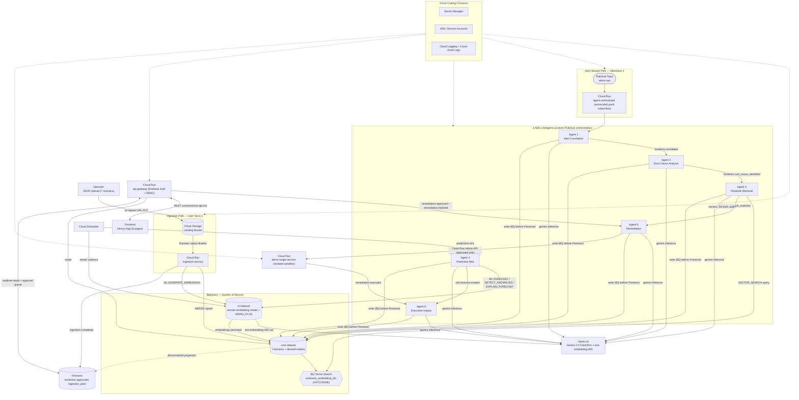
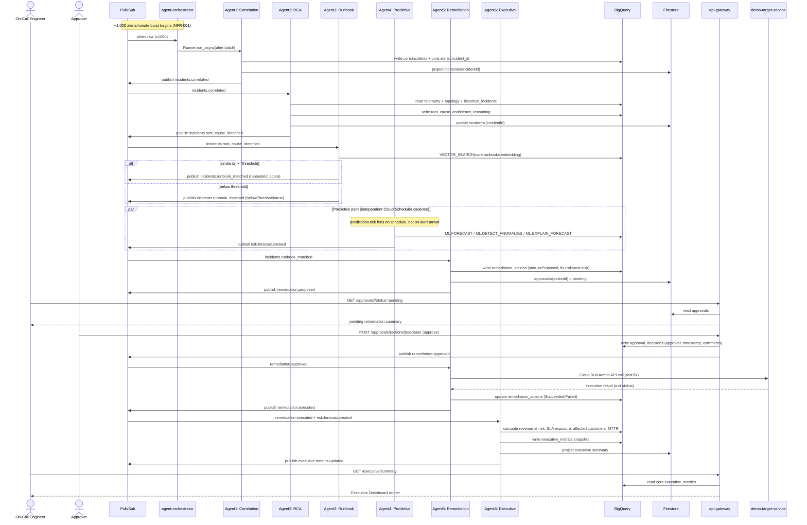
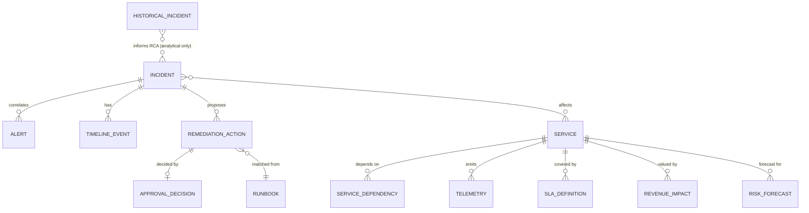

# Design: JSON-Driven Agentic AI Incident Prevention & Resolution Platform

## 1. Overview

- **Feature**: JSON-Driven Agentic AI Incident Prevention & Resolution Platform
- **Branch**: `001-json-agentic-ai`
- **Design Status**: Draft
- **Input Artifacts**: [spec.md](./spec.md), [plan.md](./plan.md), [research.md](./research.md), [data-model.md](./data-model.md), [contracts/rest-api.md](./contracts/rest-api.md), [contracts/pubsub-events.md](./contracts/pubsub-events.md)

This platform ingests seven JSON operational data domains into BigQuery (the system of record), then drives six ADK `LlmAgent`s — Alert Correlation, Root Cause Analysis, Runbook Retrieval, Predictive Risk, Remediation, and Executive Impact — through a custom Pub/Sub-driven orchestrator to turn raw alert storms into a single explained incident, a semantically-retrieved runbook, a human-approved remediation, an outage forecast, and an executive business-impact summary. BigQuery Vector Search and BigQuery ML (`ARIMA_PLUS`) provide retrieval and forecasting directly over ingested data — no hardcoded mappings or canned answers (NFR-011). Every remediation execution is real (Cloud Run Admin API against an isolated sandbox target) but is structurally gated behind explicit human approval, with Firebase Authentication/RBAC, Secret Manager, and layered audit logging enforcing security end to end.

---

## 2. Architecture Diagram

| Component | Type | Responsibility |
|---|---|---|
| Operator (JSON Upload) | Client | Uploads one JSON file per data domain through the frontend's upload flow |
| Frontend (Next.js App) | Custom app | Renders the 8 required UI pages; Firebase JS SDK for auth + realtime Firestore reads |
| Cloud Storage Landing Bucket | Managed GCP service | Durable landing zone for raw uploaded JSON (`gs://<project>-landing/<domain>/...`) |
| ingestion-service (Cloud Run) | Custom service | Validates uploads, MERGE-upserts into BigQuery, triggers synchronous runbook embedding, reports job status |
| BigQuery `core` dataset | Managed GCP service | System of record for all 7 ingested domains + derived incidents/remediation/approvals/forecasts/audit/executive tables |
| BigQuery `ml` dataset | Managed GCP service | Remote embedding model + `ARIMA_PLUS` forecast model artifacts |
| BQ Vector Search index | Managed GCP service | `VECTOR_SEARCH` semantic retrieval over `core.runbooks.embedding` — no keyword matching |
| Vertex AI | Managed GCP service (external) | Serves Gemini 2.5 Flash/Pro (agent reasoning) and `text-embedding-005` (via BQ remote model) |
| Pub/Sub `alerts.raw` | Managed GCP service | Streaming ingress for the alert burst / demo storm simulator |
| agent-orchestrator (Cloud Run) | Custom service | Hosts the 6 ADK `LlmAgent`s behind per-topic push subscriptions; autoscales independently for burst load |
| Agent 1–6 | Custom (ADK `LlmAgent`) | See §3.2 for per-agent responsibility |
| Firestore | Managed GCP service | Live denormalized incident/approval/ingestion-job projection for realtime UI reads |
| api-gateway (Cloud Run) | Custom service | BFF: Firebase auth + RBAC, REST contract, sole publisher of approval decisions, audit logging |
| Cloud Scheduler | Managed GCP service | Drives Agent 4's forecast cadence and the `ARIMA_PLUS` retrain cadence |
| demo-target-service (Cloud Run) | Custom service (sandbox) | Isolated, low-privilege real execution target for approved remediations |
| Secret Manager | Managed GCP service | Managed store for the few credentials/connection secrets mounted into Cloud Run |
| IAM / Service Accounts | Managed GCP service | Least-privilege, per-service identity governing all service-to-service access |
| Cloud Logging + Cloud Audit Logs | Managed GCP service | Operational logs + GCP-native Admin Activity audit trail (see §7.4) |

---

## 3. Component Architecture

### 3.1 Cloud Run Services

- **ingestion-service** — validates each of the 7 upload domains against a JSON Schema, MERGE-upserts into `core.*` using the per-domain natural id/hash key (Clarification #1), synchronously calls `ML.GENERATE_EMBEDDING` for runbooks, and updates `ingestion_jobs/{job_id}` (pending → in_progress → succeeded/failed) to satisfy FR-007.
- **agent-orchestrator** — hosts all 6 ADK agents behind independent Pub/Sub push subscriptions; a custom orchestrator layer invokes `Runner.run_async(...)` per stage keyed by `incident_id`, persists BigQuery then Firestore then publishes the next event (research.md §6); scales independently to absorb the ≥1,000 alerts/minute burst (NFR-001/002).
- **api-gateway** — Backend-for-Frontend for all 8 UI pages; verifies Firebase ID tokens and enforces custom-claim RBAC (FR-041); the only code path that can publish `remediation.approved`/`remediation.rejected` (research.md §7); writes `core.audit_log` for every security-relevant request (FR-043).
- **demo-target-service** — isolated, low-privilege Cloud Run service that is the literal target of real remediation execution (Cloud Run Admin API traffic-split/restart/scale calls, and their reverse as rollback); contains blast radius to a purpose-built service, never production infrastructure (research.md §8).

### 3.2 ADK Agents & Orchestration Pattern

- **Agent 1 — Alert Correlation**: dedupes/groups streaming alerts into one incident cluster (FR-009); publishes `incidents.correlated`.
- **Agent 2 — Root Cause Analysis** (`gemini-2.5-pro`): analyzes telemetry, topology, and historical incidents to produce root cause + confidence + reasoning (FR-010); publishes `incidents.root_cause_identified`.
- **Agent 3 — Runbook Retrieval**: queries `VECTOR_SEARCH` over `core.runbooks.embedding` only, never keyword matching (FR-011); publishes `incidents.runbook_matched`, with `belowThreshold=true` instead of presenting a low-confidence guess as authoritative (FR-028).
- **Agent 4 — Predictive Risk**: triggered by `predictions.tick` (Cloud Scheduler, independent of alert traffic so forecasts can precede the alert they predict, AC-4.1); runs `ML.FORECAST` / `ML.DETECT_ANOMALIES` / `ML.EXPLAIN_FORECAST` against `ml.telemetry_forecast_model` (FR-012, FR-031); publishes `risk.forecast.created`.
- **Agent 5 — Remediation**: a proposal tool generates fix/rollback/risk (FR-013); a **physically separate** execution tool is reachable only from the `remediation.approved` event, never from the LLM's own judgement (research.md §7); calls the real Cloud Run Admin API against `demo-target-service`; publishes `remediation.executed`.
- **Agent 6 — Executive Impact**: computes affected customers, revenue at risk, SLA exposure, and MTTR reduction (FR-014, FR-034–FR-036) from `remediation.executed` + `risk.forecast.created` plus its own Scheduler cadence; publishes `executive.metrics.updated`.
- **Orchestration pattern**: each agent is a plain ADK `LlmAgent` (structured `output_schema`, per-agent model, domain tools) invoked via `Runner.run_async`. Composition uses a **custom event-driven orchestrator**, not ADK's `SequentialAgent`/`ParallelAgent`/`LoopAgent` — those are deprecated upstream in favor of a graph-based `Workflow` API that cannot yet be used as an `LlmAgent` sub-agent (research.md §5). The custom orchestrator lets each stage scale and schedule independently on Cloud Run and survive a subscriber being temporarily down (NFR-012).

### 3.3 Pub/Sub Topics

| Topic | Producer → Consumer | Purpose |
|---|---|---|
| `ingestion.file-uploaded` | Eventarc (GCS finalize) → ingestion-service | Triggers ingestion for a newly uploaded file |
| `ingestion.completed` | ingestion-service → informational | Marks a domain upload succeeded; updates `ingestion_jobs` |
| `alerts.raw` | ingestion-service / demo storm simulator → Agent 1 | Streaming alert ingress (NFR-001) |
| `incidents.correlated` | Agent 1 → Agent 2 | Hands off a newly clustered incident |
| `incidents.root_cause_identified` | Agent 2 → Agent 3 | Hands off root cause for runbook matching |
| `incidents.runbook_matched` | Agent 3 → Agent 5 | Hands off matched runbook or below-threshold flag |
| `remediation.proposed` | Agent 5 → api-gateway | Surfaces a pending approval; no auto-execution consumer exists (NFR-009) |
| `remediation.approved` / `remediation.rejected` | api-gateway (`/approvals/{id}/decision`) → Agent 5 | The **only** path to real execution, or returns the incident to an actionable state (FR-026) |
| `remediation.executed` | Agent 5 → Agent 6, Firestore | Real execution outcome (succeeded/failed) |
| `predictions.tick` | Cloud Scheduler → Agent 4 | Forecast cadence, independent of alert traffic |
| `risk.forecast.created` | Agent 4 → Agent 6 | New forecast/anomaly for executive aggregation |
| `executive.metrics.updated` | Agent 6 → Firestore/UI | Recomputed executive snapshot |

Every topic has a `<topic>-dlq` after 5 delivery attempts, so one stuck stage never blocks the rest of the pipeline (NFR-012).

### 3.4 Firestore Collections

- `incidents/{incident_id}` — status, root cause, confidence, affected services, correlated alert count, current stage: a live UI projection of `core.incidents`.
- `approvals/{action_id}` — pending/approved/rejected queue backing the Approval Console (risk level, proposer, decision metadata).
- `ingestion_jobs/{job_id}` — per-upload status (pending/in_progress/succeeded/failed) + error reason, satisfying FR-007.

Firestore is never the system of record — every field is written after the corresponding BigQuery write (data-model.md).

---

## 4. Key Flow — End-to-End Demo Sequence

This sequence diagram traces the spec's Primary Demonstration Flow — the composition of all five user stories — end to end: alert burst → clustering → root cause analysis → runbook retrieval → an independently-scheduled prediction → remediation proposal → human approval → real sandbox execution → executive dashboard refresh.

---

## 5. Data Model Summary

Full DDL for every table lives in [data-model.md](./data-model.md); this section summarizes storage location, upsert key, and traceability notes for each `spec.md` Key Entity.

| Entity (spec.md) | ERD Name | BigQuery Table(s) | Upsert / Natural Key | Notes |
|---|---|---|---|---|
| Alert | ALERT | `core.alerts` | source id, else hash(source, resource_id, description, first_seen_at) | `incident_id` set once correlated |
| Incident | INCIDENT | `core.incidents`, `core.incident_timeline_events` | `incident_id` (system-generated) | status enum enforced in application layer |
| Telemetry Reading | TELEMETRY | `core.telemetry` | (service_id, metric_name, ts) | feeds `ARIMA_PLUS` |
| Historical Incident Record | HISTORICAL_INCIDENT | `core.historical_incidents` | source id, else hash(title, opened_at) | RCA/prediction precedent only, no FK |
| Runbook / SOP | RUNBOOK | `core.runbooks` | source id, else hash(title, steps) | embedding via `ML.GENERATE_EMBEDDING` |
| Service Topology / Dependency Graph | SERVICE, SERVICE_DEPENDENCY | `core.services`, `core.service_dependencies` | service_id / (service_id, depends_on_service, relationship_type) | scopes blast radius |
| SLA Definition | SLA_DEFINITION | `core.sla_definitions` | source id, else hash(service_id, customer_segment) | drives SLA exposure calc |
| Revenue Impact Record | REVENUE_IMPACT | `core.revenue_impact` | source id, else hash(service_id, customer_segment) | `customer_count` basis for affected-customers (Clarification #4) |
| Remediation Action | REMEDIATION_ACTION | `core.remediation_actions` | `action_id` (system-generated) | fix/rollback redacted before write |
| Approval Decision | APPROVAL_DECISION | `core.approval_decisions` | `decision_id` (system-generated) | `approver_uid` = Firebase uid |
| Risk Forecast / Prediction | RISK_FORECAST | `core.risk_forecasts` | `forecast_id` (system-generated) | never an incident status (Clarification #5) |
| Audit Log Entry | *(omitted, append-only)* | `core.audit_log` | `entry_id` (system-generated) | distinct from Cloud Logging (§7.4) |
| Executive Metrics Snapshot | *(omitted, append-only)* | `core.executive_metrics` | `snapshot_ts` | refreshed on event + Scheduler cadence |
| User / Role | *(external)* | Firebase Authentication custom claims | Firebase uid | not a BigQuery table |

`core.audit_log` and `core.executive_metrics` are append-only logs/snapshots with no meaningful foreign-key relationships and are omitted from the diagram above.

---

## 6. API Contract Summary

Full request/response schemas live in [contracts/rest-api.md](./contracts/rest-api.md) (REST) and [contracts/pubsub-events.md](./contracts/pubsub-events.md) (Pub/Sub, summarized in §3.3). This section summarizes the client-facing REST surface.

| Method & Path | Purpose | Roles |
|---|---|---|
| `POST /uploads/{domain}` | Request a v4 signed GCS upload URL | OnCallEngineer, IncidentCommander, Administrator |
| `GET /uploads/{jobId}` | Poll ingestion status (FR-007) | Any authenticated |
| `GET /incidents?status=open\|resolved\|all` | List incidents | Any authenticated |
| `GET /incidents/{incidentId}` | Full incident detail | Any authenticated |
| `GET /incidents/{incidentId}/alerts` | Correlated alerts (FR-017) | Any authenticated |
| `GET /incidents/{incidentId}/timeline` | Ordered timeline events (FR-018) | Any authenticated |
| `GET /incidents/{incidentId}/dependency-graph` | Blast-radius dependency graph | Any authenticated |
| `GET /incidents/{incidentId}/runbook-matches` | Matched runbooks + similarity (FR-021) | Any authenticated |
| `GET /incidents/{incidentId}/remediation` | Latest remediation action, already redacted | Any authenticated |
| `GET /approvals?status=pending` | Pending approval queue | Approver, IncidentCommander, Administrator |
| `POST /approvals/{actionId}/decision` | Approve or reject a remediation (FR-024/FR-025) | Approver, IncidentCommander, Administrator |
| `GET /predictions?activeOnly=true` | Active forecasts (FR-032) | Any authenticated |
| `GET /predictions/anomalies` | Flagged anomaly trends (FR-031) | Any authenticated |
| `GET /executive/summary` | Executive metrics snapshot (FR-037/FR-038) | ExecutiveViewer, IncidentCommander, Administrator |
| `GET /me` | Resolve caller's uid/role for consistent UI gating (FR-040) | Any authenticated |

All requests require `Authorization: Bearer <Firebase ID token>`; `api-gateway` verifies the token and reads the `role` custom claim (`OnCallEngineer | IncidentCommander | Approver | ExecutiveViewer | Administrator`). Every error response uses `{ "error": { "code", "message" } }` with `401` (missing/invalid token), `403` (role not permitted), `404`, `422` (validation), or `500`. Every request that views incident data or performs a security-relevant action writes a `core.audit_log` row (FR-043, §7.4).

---

## 7. Security Architecture

### 7.1 IAM & Service Accounts

| Component | Service Account (illustrative) | Key IAM Roles | Scope Notes |
|---|---|---|---|
| ingestion-service | `sa-ingestion@<project>` | `roles/storage.objectViewer` (landing bucket), `roles/bigquery.dataEditor` + `roles/bigquery.jobUser` (core, ml), `roles/pubsub.publisher` | Dataset-scoped, never project-wide |
| agent-orchestrator | `sa-orchestrator@<project>` | `roles/pubsub.subscriber` + `roles/pubsub.publisher` (agent topics), `roles/bigquery.dataEditor` + `jobUser`, `roles/datastore.user`, `roles/aiplatform.user` | Hosts all 6 agents; can be split per-agent post-hackathon for tighter scoping |
| api-gateway | `sa-api-gateway@<project>` | `roles/datastore.user`, `roles/bigquery.dataViewer` + `jobUser`, `roles/pubsub.publisher` (approval topics), `roles/iam.serviceAccountTokenCreator` (self, for signed URLs) | Verifies Firebase ID tokens; never holds end-user credentials |
| Remediation execution path | `sa-remediation-executor@<project>` | `roles/run.developer` bound **only** on `demo-target-service` (resource-level IAM, not project-wide) | Narrowest possible scope for the one code path that can mutate a running service |
| demo-target-service | `sa-demo-target@<project>` | No elevated roles; receives calls, never initiates them | Purpose-built, isolated, disposable |
| Cloud Scheduler jobs | `sa-scheduler@<project>` | `roles/pubsub.publisher` (`predictions.tick`), `roles/run.invoker` (retrain trigger) | Narrow, single-purpose |
| Terraform / CI deploy | `sa-terraform-deploy@<project>` | Broad, deploy-time only (custom role, editor-equivalent) | Never attached to a running Cloud Run service |

### 7.2 Secret Manager

- **Firebase Admin SDK credentials** (used by `api-gateway` to verify ID tokens / manage custom claims) — mounted as a Cloud Run secret volume, never baked into the container image or returned by any API (FR-042).
- **Third-party notification credentials** (e.g. Slack/PagerDuty, if added post-hackathon) — same mounting pattern; none required for the current spec.
- **Signed-URL issuance** (`POST /uploads/{domain}`) prefers the IAM Credentials API `signBlob` call (via `roles/iam.serviceAccountTokenCreator` self-impersonation) over a static service-account key file, so no long-lived signing key exists to leak.
- **Firebase Web client config** (API key, project id) is public-by-design and delivered via frontend build-time env — intentionally **not** stored in Secret Manager, to avoid over-classifying a non-secret.
- All BigQuery/Pub/Sub/Firestore/Vertex AI/Cloud Run Admin API access uses the attached Cloud Run service identity (§7.1) rather than manually managed keys, keeping the actual Secret Manager surface area small and auditable.

### 7.3 PII / Secret Redaction Placement

Two enforcement points (research.md §10), both using a shared `agents/common/redaction.py` utility:

1. **Ingestion time** — before free-text fields (`alerts.description`, `runbooks.content`, `historical_incidents.summary`, telemetry log snippets) are written to BigQuery (data-model.md validation rules).
2. **Agent-output time** — before any summary, root-cause explanation, or remediation/rollback script (`remediation_actions.fix_script` / `rollback_script`) reaches the UI, a dashboard, or a Cloud Logging sink.

This is defense-in-depth: even if unredacted content ever entered `core.*`, agent-output redaction still prevents exposure (FR-033, FR-044, NFR-006, NFR-007). Cloud DLP `deidentify` is noted as an optional post-hackathon hardening upgrade, not required for the mandatory-service list.

### 7.4 Audit Logging

1. **`core.audit_log`** (BigQuery) — application-level, security-relevant actions only: upload, incident access, approval decision, remediation execution (FR-043); queryable for compliance review, distinct from operational logs.
2. **Cloud Logging** — operational/service logs (request traces, agent tool errors, retries); redacted per §7.3 before emission; used for on-call debugging, not compliance.
3. **Cloud Audit Logs** (GCP-native Admin Activity) — automatically captures IAM changes, Secret Manager access, and the Cloud Run Admin API calls Agent 5 makes against `demo-target-service`, giving an independent, tamper-evident trail of the one code path capable of mutating infrastructure.

---

## 8. Technology Decisions

| Decision | Choice | Rationale | Rejected Alternatives |
|---|---|---|---|
| Reasoning/generation model | `gemini-2.5-flash` default, `gemini-2.5-pro` for RCA | GA-stable, ADK's reference model, configurable via env/Terraform | `gemini-3.6/3.8-flash` (newer, higher quota/rollout risk pre-demo) |
| Embedding model & path | `text-embedding-005` via BQ remote model + synchronous `ML.GENERATE_EMBEDDING` | Deterministic "searchable immediately" bound (FR-003/NFR-004) | Autonomous `AI.EMBED` async column (unbounded latency); direct Vertex AI SDK calls (breaks "everything in BigQuery") |
| Vector search | `VECTOR_SEARCH` + `CREATE VECTOR INDEX` (IVF/COSINE) | GA syntax, mandatory-service fit, degrades to brute force gracefully | External vector DB (violates mandatory-service constraint) |
| Forecasting/anomaly model | BQML `ARIMA_PLUS` (+ `ML.FORECAST`/`DETECT_ANOMALIES`/`EXPLAIN_FORECAST`) | One model serves both FR-012 and FR-031 with no hand-built features | `BOOSTED_TREE_CLASSIFIER` over engineered windows (manual feature engineering contradicts NFR-011) |
| Agent orchestration | Custom Pub/Sub-driven orchestrator calling `LlmAgent` + `Runner` per stage | `Sequential/Parallel/LoopAgent` are deprecated upstream; matches the event-driven, independently-scalable Cloud Run shape | ADK `SequentialAgent`/`ParallelAgent`/`LoopAgent` (deprecated); new `Workflow` graph API (too new, not yet usable as an `LlmAgent` sub-agent) |
| Inter-agent state/comm | Pub/Sub topics + BigQuery (system of record) + Firestore (live projection); BQ-then-Firestore-then-publish ordering | Matches the spec's own architecture requirement; consistent, audit-safe ordering | Firestore-only (not the mandated system of record, weak for MTTR/executive aggregation); direct agent-to-agent HTTP (fails NFR-012) |
| Human approval gate | Physically separate propose vs. execute tools; execute reachable only via `api-gateway`'s authenticated decision endpoint | Structural enforcement of NFR-009 rather than a prompt instruction | Trusting the LLM's own judgement / prompt-only gate |
| Sandbox execution target | Dedicated `demo-target-service` Cloud Run service, isolated SA, real Cloud Run Admin API calls | Satisfies Clarification #2 (real execution) while containing blast radius | Simulated/mocked execution result (excluded by clarification) |
| Auth/RBAC | Firebase Authentication/Identity Platform custom claims (5 roles) verified by `api-gateway`; GCP IAM kept separate | Matches Clarification #3; clean separation aids audit | GCP IAM alone for end users (conflates human RBAC with machine IAM) |
| Secrets/redaction/audit | Secret Manager for the few real credentials; shared redaction utility at ingestion + agent-output time; dedicated `core.audit_log` | Defense-in-depth per FR-033/FR-042/FR-044/NFR-006/NFR-007 | Cloud DLP `deidentify` (optional post-hackathon hardening, added latency/complexity) |
| Frontend | Next.js (App Router) + Firebase JS SDK realtime listeners + typed REST client for BQ-backed aggregates | Realtime feel for the Live Incident Console; polling is fine for analytical views | Pure REST/polling everywhere (loses realtime feel); Firestore-only client (loses BQ aggregation power) |

---

## 9. Error Handling Strategy

- Ingestion validation failures never partially load — a failing file produces a `failed` `ingestion_jobs` doc with a specific reason and zero rows written (FR-005, AC-1.3).
- Every Pub/Sub topic has a per-topic `-dlq` after 5 delivery attempts (contracts/pubsub-events.md), so one stuck stage or subscriber never blocks the rest of the pipeline (NFR-012).
- REST errors use one uniform shape (`{ "error": { "code", "message" } }`) with standard status codes (`401/403/404/422/500`, contracts/rest-api.md).
- A transient agent failure (e.g. a Vertex AI timeout) is retried via Cloud Run push redelivery; a persistent failure surfaces as a visibly "degraded" stage on the incident rather than blocking core alert visibility/correlation (NFR-012) — e.g. Predictive Risk being unavailable never blocks the Live Incident Console.
- Structured JSON logs correlate every log line to `incidentId`/`actionId`/`jobId` for cross-service tracing, redacted per §7.3, at `WARNING` for retries and `ERROR` when a message lands in a DLQ.

---

## 10. Non-Functional Design

| Concern | Target | Approach |
|---|---|---|
| Performance | Consolidated incident within 5 minutes of storm start (NFR-003) | Pub/Sub buffering decouples arrival from processing; each agent stage autoscales independently |
| Scalability | ≥1,000 alerts/minute, zero loss (NFR-001/NFR-002) | Cloud Run concurrency/max-instances tuned per service; DLQ prevents one slow stage causing backpressure collapse |
| Reliability | One capability's outage must not block core visibility (NFR-012) | Independent push subscriptions per stage; BQ-then-Firestore-then-publish ordering keeps the UI consistent even if a downstream stage lags |
| Freshness | Newly ingested data usable within 5 minutes (NFR-004) | Synchronous MERGE + synchronous `ML.GENERATE_EMBEDDING` at ingestion time (research.md §2) |
| Observability | Every determination carries rationale + confidence (NFR-010); actions are auditable (FR-043) | Agent `output_schema` enforces rationale/confidence fields; 3-layer logging (§7.4) |

---

## 11. Open Questions / Risks

1. **Question/Risk**: Similarity/confidence thresholds for RCA, runbook retrieval, and prediction are intentionally left configurable, not fixed by `spec.md`.
   **Impact**: an untuned threshold could produce too many `belowThreshold` results (weakening AC-3.5/SC-004) or over-confident low-quality matches.
   **Proposed Resolution**: tune against `data/samples/` fixtures during the `quickstart.md` rehearsal; expose as Terraform/env vars using the same pattern already planned for model IDs (research.md §1).
   **Owner**: Dev.
2. **Question/Risk**: Signed-URL issuance (`POST /uploads/{domain}`) depends on `roles/iam.serviceAccountTokenCreator` self-impersonation wiring not yet expressed in Terraform.
   **Impact**: the upload flow (FR-001/AC-1.1) is blocked end-to-end if misconfigured.
   **Proposed Resolution**: finalize as an explicit `/audi.tasks` item for `api-gateway`/`infra/modules/security`; add an integration test asserting a signed URL is issued and accepted by GCS.
   **Owner**: Dev.
3. **Question/Risk**: No ratified `.audi/memory/constitution.md` exists, so this design has no binding architectural principles to check against (plan.md Constitution Check: N/A).
   **Impact**: low today; a future constitution could retroactively conflict with choices here (e.g. the 3-service split, or the custom-orchestrator pattern).
   **Proposed Resolution**: re-run the Constitution Check against this design once a constitution is ratified.
   **Owner**: PO/Architect.
4. **Question/Risk**: `VECTOR_SEARCH` brute-forces until the IVF index reaches `ACTIVE`, and IVF indexes are generally most effective with larger corpora than a demo-scale runbook set.
   **Impact**: similarity ranking quality for AC-3.1/SC-004 with only a handful of seeded runbooks.
   **Proposed Resolution**: explicitly verify brute-force-fallback quality is acceptable for the demo corpus size during the `quickstart.md` rehearsal; don't gate the demo on index `ACTIVE` state.
   **Owner**: Dev.
5. **Question/Risk**: The `ARIMA_PLUS` retrain cadence (Cloud Scheduler frequency) is not yet numerically fixed anywhere in the plan.
   **Impact**: a stale model could fail to reflect the seeded degrading-trend fixture in time for AC-4.1 (a prediction must fire *before* the corresponding alert).
   **Proposed Resolution**: fix a concrete retrain cadence in `/audi.tasks` short enough to precede the demo's alert-burst step; validate during the quickstart rehearsal.
   **Owner**: Dev.
