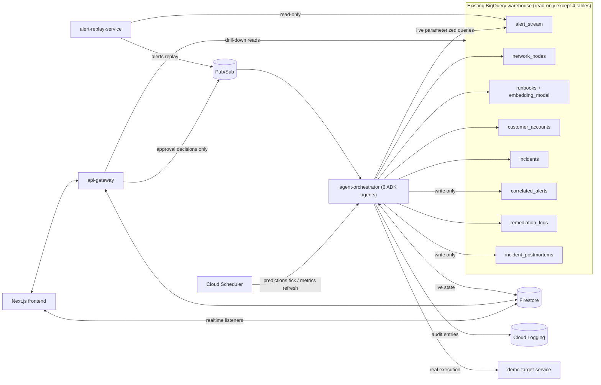

# Implementation Plan: SRE Agentic AI Incident Prevention & Resolution Platform

**Branch**: `001-json-agentic-ai` | **Date**: 2026-09-24 (re-derived in full for the existing-warehouse premise rewrite of spec.md) | **Spec**: [spec.md](./spec.md)
**Input**: Feature specification from `specs/001-json-agentic-ai/spec.md`

**Note**: This plan **replaces in full** the prior version, which described a
JSON-upload/ETL/Cloud-Storage-landing architecture no longer in scope. The
BigQuery warehouse (`sre_telemetry`, `sre_topology`, `sre_knowledge_base`,
`sre_incident_mart`) is already provisioned and populated; this feature is a
pure consumer of it. No ingestion pipeline, Cloud Storage landing, ETL, or
warehouse/table/dataset provisioning is in scope anywhere in this plan.

## Summary

Deliver a six-agent ADK platform (Alert Correlation, Root Cause Analysis,
Runbook Retrieval, Predictive Risk, Remediation, Executive Impact) that
turns a replayed burst of the existing `alert_stream` history into a single
explained incident, a semantically retrieved SOP (BigQuery `VECTOR_SEARCH`
over the existing `runbooks.embedding`), a human-approved and really-executed
fix, a BigQuery-ML-forecasted outage warning, an executive business-impact
view, and an automatically written postmortem — every output derived from
live, parameterized queries against the existing warehouse, never from
hardcoded mappings. A custom Pub/Sub-driven orchestrator (not ADK's
deprecated `SequentialAgent`/`ParallelAgent`/`LoopAgent`) calls `LlmAgent` +
`Runner` per stage; Firestore holds every live/ephemeral read model
(incidents, approvals, predictions, executive metrics); BigQuery writes are
confined to exactly the four tables FR-039 names.

## Technical Context

**Language/Version**: Python 3.12 (services/agents), TypeScript 5.x / Node.js 20+ (frontend)
**Primary Dependencies**: FastAPI, Google ADK (`google-adk`, `LlmAgent`/`Runner`), `google-cloud-bigquery`, `google-cloud-pubsub`, `google-cloud-firestore`, `google-cloud-secret-manager`, `firebase-admin`; Next.js 14 (App Router), React 18, Tailwind CSS, Firebase JS SDK
**Storage**: Existing BigQuery warehouse (read-mostly; 4 named tables appended/upserted — FR-039) + one new `sre_ml_ops` BQML dataset; Firestore (native mode) for all live/ephemeral state; Cloud Logging for the audit trail. No new relational/file storage, no Cloud Storage landing.
**Testing**: pytest (services/agents, mocked GCP clients) + Firestore/Pub/Sub emulators (no BigQuery emulator — disposable dev dataset) + Jest/Playwright (frontend) + ADK agent-eval harness + Terraform validate/plan
**Target Platform**: Google Cloud Run (Linux containers) for all backend services; browser (desktop-first) for the frontend
**Project Type**: Web application — multi-service backend + frontend, single monorepo
**Performance Goals**: ≥1,000 replayed alerts/minute sustained without loss (NFR-001); consolidated incident within ~5 minutes of burst start (NFR-003); runbook retrieval within a few seconds of root cause being identified (NFR-004)
**Constraints**: No new BigQuery tables/datasets for the existing warehouse, ever (FR-001); the 5 non-output existing tables are strictly read-only (FR-039); every non-FR-039 platform artifact lives in Firestore or Cloud Logging, never a new BigQuery table (research.md §2); single region `us-central1` co-located with the warehouse; every agent-issued BigQuery query uses named parameters, never string concatenation (research.md §18); no remediation executes without an explicit prior human approval (NFR-009)
**Scale/Scope**: ~3,000 `alert_stream` rows, ~64 `network_nodes`, ~20 `runbooks`, ~45 `customer_accounts`, ~18 historical `incidents` (demo-scale existing warehouse); 6 ADK agents; 8 frontend pages; 5 user roles

## Constitution Check

*GATE: Must pass before Phase 0 research. Re-check after Phase 1 design.*

`.audi/memory/constitution.md` is still the unfilled template for this
repository — no principles have been ratified. **Result: N/A, not a gate
failure.** There are no ratified principles to check this plan against, and
therefore nothing to justify in Complexity Tracking. If a constitution is
ratified later, re-run this check against it before further phases.

## Project Structure

### Documentation (this feature)

```text
specs/001-json-agentic-ai/
├── plan.md              # This file (/audi.plan command output)
├── research.md          # Phase 0 output (/audi.plan command)
├── data-model.md        # Phase 1 output (/audi.plan command)
├── quickstart.md        # Phase 1 output (/audi.plan command)
├── contracts/           # Phase 1 output (/audi.plan command)
│   ├── rest-api.md
│   └── pubsub-events.md
└── tasks.md             # Phase 2 output (/audi.tasks command - NOT created by /audi.plan)
```

### Source Code (repository root)

Web application monorepo (Option 2 shape, adapted to this feature's real
agent/service boundaries — this repo is currently greenfield, only `.audi/`
+ `specs/` + `graphify-out/` exist; none of the following exists yet, it is
created starting in Phase 3+ / `/audi.tasks` + `/audi.implement`):

```text
infra/                        # Terraform for NEW resources ONLY — never the
│                              # existing warehouse's datasets/tables
├── modules/
│   ├── pubsub/                # topics, dlq topics, push subscriptions
│   ├── cloud-run/              # 4 services, per-service SA + IAM
│   ├── firestore/               # native-mode DB + security rules
│   ├── bqml/                    # sre_ml_ops dataset + ARIMA_PLUS model
│   ├── scheduler/                # predictions.tick, metrics-refresh jobs
│   └── secrets/                   # Secret Manager secrets
└── environments/demo/terraform.tfvars

services/
├── alert-replay-service/        # reads alert_stream read-only, publishes alerts.replay
├── agent-orchestrator/           # FastAPI + ADK Runner; hosts all 6 agents' stages
│   └── app/
│       ├── stages/                # one handler per Pub/Sub subscription (§ Architecture)
│       └── common/                 # redaction.py, bq_client.py, firestore_client.py
└── api-gateway/                    # BFF: REST contract, approval decision gate

agents/                              # 6 ADK LlmAgent modules (prompts, tools, output_schema)
├── alert_correlation/
├── root_cause_analysis/
├── runbook_retrieval/
├── predictive_risk/
├── remediation/
└── executive_impact/

frontend/                             # Next.js dashboard app, 8 pages (FR-033)
├── app/
│   ├── incidents/                     # Live Incident Console, Incident Timeline
│   ├── correlation/                    # Alert Correlation View
│   ├── root-cause/                      # Root Cause Analysis View
│   ├── runbooks/                         # Runbook Recommendation View
│   ├── approvals/                         # Approval Console
│   ├── predictions/                        # Predictive Health Dashboard
│   └── executive/                           # Executive Dashboard
└── lib/ (firebase client, api-gateway REST client)

scripts/
├── deploy/                # build-and-push.ps1, deploy-all.ps1
└── demo/                   # seed-demo-users.ps1, start-alert-replay.ps1, redaction-scan.ps1

data/samples/                # LOCAL DEV/TEST FIXTURES ONLY — never used to seed
│                             # or provision the real warehouse
tests/
├── contract/                 # REST + Pub/Sub payload shape tests
├── integration/                # emulator-backed, per service
└── unit/                         # per agent/service
```

**Structure Decision**: Monorepo, one Terraform root for new-only
infrastructure, one Cloud Run service per operational boundary
(replay/orchestrator/gateway/sandbox-target), agent logic isolated under
`/agents` so each `LlmAgent` is independently testable/promptable outside
the orchestrator, and `/data/samples` explicitly scoped to local
dev/test — never warehouse seeding, per the Out of Scope section of
spec.md.

## Architecture Overview



Six ADK `LlmAgent`s run as stage handlers inside `agent-orchestrator`, each
reachable only via its own Pub/Sub push subscription (research.md §9/§17) —
not ADK's deprecated `SequentialAgent`/`ParallelAgent`/`LoopAgent`. BigQuery
writes are confined to exactly `correlated_alerts`, `incidents`,
`remediation_logs`, `incident_postmortems` (FR-039); every other
platform-computed artifact (approval queue, live incident/prediction/
executive-metrics projections, the alert-clustering window) lives in
Firestore, and the audit trail lives in Cloud Logging (research.md §2 — the
single rule that eliminates the six extraneous BigQuery tables the prior,
stale version of this plan had invented).

## Agent-to-Warehouse Query Patterns (summary — full SQL in data-model.md)

| # | Agent | Model | Reads (join path) | Writes | Spec refs |
|---|---|---|---|---|---|
| 1 | Alert Correlation | gemini-2.5-flash | `network_nodes` (via `node_id`); precedent via `correlated_alerts`→`alert_stream`→`incidents` | `correlated_alerts`, `incidents` (new) | FR-006–FR-011, data-model.md §2 |
| 2 | Root Cause Analysis | gemini-2.5-pro | `correlated_alerts`→`alert_stream`→`network_nodes`; historical `incidents`↔`remediation_logs` | `incidents` (update) | FR-009, data-model.md §3 |
| 3 | Runbook Retrieval | gemini-2.5-flash | `VECTOR_SEARCH` over `runbooks.embedding`, query embedded via `AI.GENERATE_EMBEDDING`/`sre_knowledge_base.embedding_model` | none (Firestore `approvals` draft only, via Agent 5) | FR-012–FR-014, data-model.md §4 |
| 4 | Predictive Risk | gemini-2.5-flash | `sre_ml_ops.alert_trend_forecast_model` (`ML.FORECAST`/`ML.DETECT_ANOMALIES`/`ML.EXPLAIN_FORECAST`), trained from `alert_stream` | Firestore `predictions/*` only — no BigQuery write | FR-022–FR-023, data-model.md §5 |
| 5 | Remediation | gemini-2.5-flash | `runbooks` by `runbook_id` | Firestore `approvals/*`; `remediation_logs` (append, post-execution only) | FR-015–FR-021, data-model.md §6 |
| 6 | Executive Impact | gemini-2.5-flash | `correlated_alerts`→`alert_stream`→`customer_accounts`; `incidents`↔`remediation_logs` | `incident_postmortems` (MERGE); Firestore `executive_metrics/latest` | FR-027–FR-032, data-model.md §7 |

All 6 join paths above trace directly to the FR-005 relationships
(`alert_stream.node_id → network_nodes.node_id`,
`alert_stream.service_name → customer_accounts.service_name`,
`correlated_alerts ↔ incidents/alert_stream`,
`remediation_logs ↔ incidents/runbooks`,
`incident_postmortems → incidents`), every join is `LEFT JOIN` so an
unresolved relationship is marked `Unmapped` rather than dropping the row
(FR-005), and every query parameter is a named BigQuery `@param` (research.md §18).

## Replay/Streaming Simulation Approach

`alert-replay-service` is the **only** reader of `alert_stream` at the raw
row level; it never mutates it. It loops over the ~3,000 rows (ordered by
`timestamp`) at a controlled rate to sustain ≥1,000 msgs/min, wrapping each
occurrence in an envelope with a fresh `replayEventId` (UUID) and a
rewritten `occurredAt` timestamp (FR-004, Clarification #2; full envelope
shape in `contracts/pubsub-events.md` → `alerts.replay`). Every downstream
agent dedups/clusters on `replayEventId`, never the reused natural
`alertId`, so looping the finite history never collapses repeated passes
into "the same alert already seen." See research.md §11 for the full
decision and rationale.

## Postmortem Write Path

The Executive Impact Agent runs a single `MERGE` against
`incident_postmortems`, keyed on `incident_id`, incrementing `version` on an
existing row instead of inserting a duplicate — exact statement in
research.md §16 / data-model.md §7, using precisely the column set the
spec's Clarification defined (`root_cause_summary`, `timeline_summary`,
`remediation_summary`, `business_impact_summary`, `full_report_markdown`,
`version`). Triggered once per `incidents.resolved` event (FR-031); running
it again for the same incident updates rather than duplicates (FR-032,
verified in quickstart.md step 4.8).

## Approval Workflow (Human-in-the-Loop)

1. Agent 5 (Remediation) generates a fix + rollback script from the matched
   runbook's documented procedure (never hardcoded) and writes a
   `Proposed` document to Firestore `approvals/{actionId}` — this document
   **is** the Remediation Action and (once decided) the Approval Decision
   record; there is no separate BigQuery table for either (research.md §2).
2. `api-gateway`'s `POST /approvals/{actionId}/decision` is the **only**
   code path that can move an action to `Approved` — never the LLM's own
   judgement (NFR-009, research.md §12). The handler writes the Firestore
   doc (approver uid, decision, comments, timestamp — FR-018), a Cloud
   Logging audit entry (FR-037), then publishes `remediation.approved` or
   `remediation.rejected`.
3. Only `remediation.approved` reaches Agent 5's execution tool, which
   calls the real Cloud Run Admin API against the isolated
   `demo-target-service` (never production) and appends the literal outcome
   to `remediation_logs` (FR-019/FR-020).
4. A rejection (FR-021) returns the incident to `Investigating` in
   Firestore with no BigQuery write — the incident remains actionable
   (e.g., a different runbook, escalation), never stuck.
5. `remediation_logs` therefore only ever contains **real, approved,
   executed** outcomes — 100% of rows have a corresponding `Approved`
   decision, directly satisfying SC-004 (verified in quickstart.md §5).

## Testing & Verification Strategy

| Requirement cluster | Verification method |
|---|---|
| FR-001–FR-005 (warehouse grounding, no new provisioning, join correctness) | Terraform plan diff reviewed to contain zero changes to the 4 existing datasets; integration test asserting every agent query targets only the documented tables; unit test for `Unmapped` marking on a deliberately-orphaned `node_id`/`service_name` fixture |
| FR-006–FR-011 (clustering, timeline, dependency graph) | Integration test replaying a synthetic burst of related + unrelated fixture alerts, asserting one vs. two incidents respectively (AC-1.1/AC-1.4) |
| FR-012–FR-014 (runbook retrieval) | Contract test against `VECTOR_SEARCH` response shape; fixture incident with no close runbook match asserts `belowThreshold=true` (AC-2.5) |
| FR-015–FR-021 (remediation + approval) | Integration test asserting the execution tool is unreachable without a prior `remediation.approved` event (NFR-009); real (non-mocked) Cloud Run Admin API call against `demo-target-service` in a dedicated demo-environment test |
| FR-022–FR-026 (prediction, scale, redaction) | Load-test script publishing ≥1,000 msgs/min to `alerts.replay`, asserting zero `-dlq` messages against the concrete autoscaling table (research.md §17); redaction unit tests with known secret/PII canaries |
| FR-027–FR-032 (executive impact, postmortem) | Fixture incident linked to `customer_accounts`; assert computed revenue/SLA/affected-customer figures match the documented formulas (data-model.md §7); re-trigger postmortem generation twice, assert `version` increments with no duplicate row (FR-032/SC-010) |
| FR-033–FR-034 (UI) | Playwright e2e covering navigation across all 8 pages preserving incident identity |
| FR-035–FR-039 (security/governance) | Firebase custom-claim RBAC test per role; Secret Manager scan (no plaintext secrets in logs/UI/scripts, SC-008); Cloud Logging audit-entry assertion per security-relevant action |
| **NFR-011 (no hardcoded mappings/logic)** | CI static check blocking literal alert/runbook/service identifiers in agent source outside test fixtures; ADK agent-eval run against a held-out `alert_stream`/`runbooks` subset never referenced in any prompt or test, confirming outputs are derived, not memorized |
| **NFR-001/002 (scale/autoscaling)** | Load test validated against the *quantified* per-subscription concurrency/min/max-instance table in research.md §17 (not just "autoscaling enabled") |
| **SQL injection / parameterization** | CI grep/lint rule rejecting f-string/`.format()`/`+`-concatenated SQL in agent/service source; every query in data-model.md already modeled with named `@param`s (research.md §18) |
| NFR-003/004 (latency targets) | Synthetic timer around the demo replay run (burst start → incident visible; root cause set → runbook match returned) |
| NFR-012 (graceful degradation) | Chaos test disabling Agent 3/4 mid-demo, asserting Agent 1/2 (core incident visibility/correlation) keep functioning |

## Security & Governance Summary

| Service | Service Account (least privilege) | Key IAM roles |
|---|---|---|
| `alert-replay-service` | `sa-alert-replay` | `roles/bigquery.dataViewer` (scoped to `sre_telemetry`), `roles/pubsub.publisher` (`alerts.replay`) |
| `agent-orchestrator` | `sa-agent-orchestrator` | `roles/bigquery.dataViewer` (4 existing datasets), `roles/bigquery.dataEditor` (scoped to `sre_incident_mart` only), `roles/bigquery.connectionUser`, `roles/aiplatform.user`, `roles/pubsub.subscriber`+`publisher`, `roles/datastore.user`, `roles/secretmanager.secretAccessor`, `roles/run.developer` (scoped only to `demo-target-service`) |
| `api-gateway` | `sa-api-gateway` | `roles/datastore.user`, `roles/pubsub.publisher` (approval decision events only), `roles/bigquery.dataViewer` (read-only drill-downs) |
| `demo-target-service` | `sa-demo-target` | Invocable only by `sa-agent-orchestrator`; no BigQuery/Pub/Sub access at all |

Firebase Authentication (custom `role` claims: OnCallEngineer,
IncidentCommander, Approver, ExecutiveViewer, Administrator) governs
end-user RBAC and is entirely separate from the GCP IAM table above, which
governs only service-to-service access (FR-035, research.md §14). Secrets
live only in Secret Manager; redaction runs at read/output time on every
free-text warehouse field before it reaches a prompt, dashboard, script, or
log line (research.md §15); every security-relevant action writes a
structured Cloud Logging entry (FR-037, data-model.md §10).

## Complexity Tracking

No entries — Constitution Check found no ratified principles to violate
(see above), and no part of this design otherwise deviates from the
simplest structure that satisfies the spec (e.g., Firestore/Cloud Logging
were chosen specifically to *avoid* inventing extra BigQuery tables, not to
add complexity).

## Next Phase

Phase 0 (research.md) and Phase 1 (data-model.md, contracts/, quickstart.md)
outputs above are complete and internally consistent with the rewritten
spec.md. Ready for `/audi.tasks` to generate `tasks.md` (Phase 2 — not
produced by this command).
